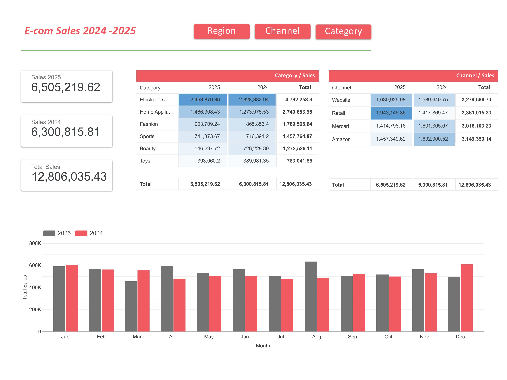

# 📊 Sales Trend Analysis (2024 vs 2025)

This project demonstrates how to model, serialize, and visualize sales data across multiple years using **BigQuery** and **Looker Studio**.  
It focuses on transforming raw yearly data into a unified dataset that allows dynamic **year-over-year comparisons** without overlaying multiple dashboards.

---

## 🚀 Project Overview

Many teams face visualization limitations when comparing data across years — for example, overlaying separate dashboards for 2023, 2024, and 2025.  
This project resolves that by **serializing multi-year data** in BigQuery, allowing a single dashboard to dynamically visualize all years with a consistent Y-axis.

**Key Features:**
- Combine multiple year tables (2024 & 2025) into one serialized dataset
- Aggregate sales by month, category, and region
- Visualize year-over-year trends in Looker Studio
- Identify top-selling categories per region

---

## 🧱 Folder Structure

01-sales-trend/
├── images/ # Dashboard and chart previews
│ ├── serialized_sales-images-0.jpg
│ ├── serialized_sales-images-1.jpg
│ ├── serialized_sales-images-2.jpg
│ └── serialized_sales-images-3.jpg
│
├── queries/ # SQL queries for BigQuery
│ ├── 01_raw_data_preview.sql
│ ├── 01_serialized_sales_table.sql
│ ├── 03_category_analysis.sql
│ └── 04_monthly_trend.sql
│
├── sales_data/ # Synthetic CSV data for demo
│ ├── generate_sales_data.py
│ ├── sales_2024.csv
│ └── sales_2025.csv
│
└── README.md # Project documentation


---

## 🧮 Data Pipeline Overview

1. **Data Generation**  
   `sales_data/generate_sales_data.py` creates mock CSV files for 2024 and 2025 sales with realistic data across 6 categories, 6 regions, and 4 sales channels.

2. **Data Upload**  
   CSVs are uploaded to BigQuery as `ecom_data.sales_2024` and `ecom_data.sales_2025` tables.

3. **Data Preview**  
   Query `01_raw_data_preview.sql` allows you to inspect the raw data and compare schemas between year tables.

4. **Serialization (Union)**  
   Query `01_serialized_sales_table.sql` creates `ecom_data.sales_serialized` table by combining yearly data with a `year` column added. This unified table contains all transaction-level data from both years.

5. **Analysis Queries**
   - `03_category_analysis.sql`: Aggregates sales by region and category to identify top-performing combinations
   - `04_monthly_trend.sql`: Calculates monthly sales totals grouped by year for year-over-year trend analysis

6. **Visualization**  
   Looker Studio connects directly to the `ecom_data.sales_serialized` table for:
   - Line charts (monthly trend comparison across years)
   - Bar charts (regional and category insights)
   - Summary tables (category performance by region)

---

## 🖼️ Dashboard Preview

Dashboard visualizations showcasing year-over-year trends, category analysis, and regional insights.



---

## 🧠 Technical Stack

- **BigQuery** – Data storage, transformation, and SQL modeling  
- **Looker Studio** – Dashboard creation and data visualization  
- **Python (optional)** – Generate mock sales data for demonstration  
- **SQL (BigQuery Standard SQL)** – Data preparation and aggregation  

---

## 📈 Example Queries

### Serialized Sales Table
Creates a unified table combining 2024 and 2025 data:
```sql
CREATE OR REPLACE TABLE ecom_data.sales_serialized AS
SELECT
  '2024' AS year,
  date,
  product_id,
  category,
  units_sold,
  unit_price,
  value,
  region,
  channel
FROM `ecom_data.sales_2024`

UNION ALL

SELECT
  '2025' AS year,
  date,
  product_id,
  category,
  units_sold,
  unit_price,
  value,
  region,
  channel
FROM `ecom_data.sales_2025`;
```

### Monthly Trend Analysis
Aggregates monthly sales for year-over-year comparison:
```sql
SELECT
  year,
  month_number,
  month_name,
  SUM(total_sales) AS monthly_sales
FROM `project_id.dataset.serialized_sales`
GROUP BY year, month_number, month_name
ORDER BY month_number, year;
```
*Note: This query assumes the serialized table includes `month_number`, `month_name`, and `total_sales` columns. These can be derived from the `date` and `value` columns if needed.*

### Category Analysis by Region
Identifies top-performing category-region combinations:
```sql
SELECT
  region,
  category,
  SUM(total_sales) AS region_sales
FROM `project_id.dataset.serialized_sales`
GROUP BY region, category
ORDER BY region, region_sales DESC;
```
*Note: This query assumes the serialized table includes a `total_sales` column. Use `value` column from the base serialized table, or aggregate `units_sold * unit_price` if needed.*


