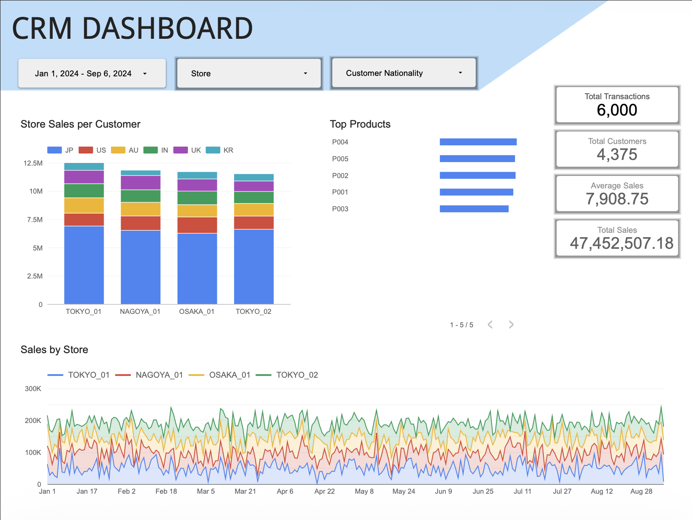
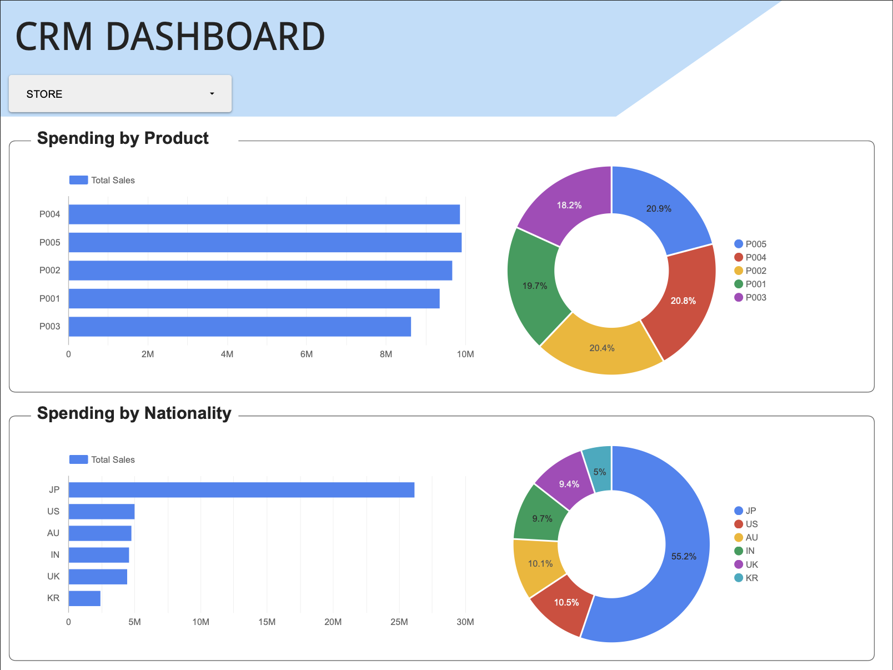

# 📈 CRM Reporting Dashboard

This project demonstrates a sample dashboard for **automating CRM data extraction** and linking **BigQuery** data to **Looker Studio**.  
The dashboard showcases how to streamline CRM reporting workflows by connecting CRM systems to BigQuery and visualizing the data in Looker Studio.

---

## 🚀 Project Overview

This dashboard is a sample implementation from a project focused on automating CRM data extraction and creating seamless data pipelines from CRM systems to BigQuery, ultimately visualized in Looker Studio.

**Key Features:**
- Automated CRM data extraction workflows
- Data transformation and storage in BigQuery
- Real-time dashboard visualization in Looker Studio
- Sample POS (Point of Sale) data integration

---

## 🧱 Folder Structure

```
02-CRM-Reporting/
├── images/                    # Dashboard previews
│   ├── page_1.png
│   └── page_2.png
│
├── data/                      # Sample data files
│   └── sample_pos_data.csv
│
└── README.md                  # Project documentation
```

---

## 🧮 Data Pipeline Overview

1. **CRM Data Extraction**  
   Automated processes extract data from CRM systems, ensuring consistent and up-to-date information.

2. **Data Transformation**  
   Raw CRM data is cleaned, transformed, and prepared for analysis using BigQuery's powerful SQL capabilities.

3. **BigQuery Storage**  
   Processed data is stored in BigQuery tables, enabling scalable analytics and efficient querying.

4. **Looker Studio Integration**  
   BigQuery data sources are connected to Looker Studio dashboards for interactive visualization and reporting.

5. **Dashboard Visualization**  
   Multiple dashboard pages provide comprehensive insights into CRM metrics, customer data, and business performance.

---

## 🖼️ Dashboard Preview

### Page 1


### Page 2


---

## 🧠 Technical Stack

- **CRM Systems** – Source systems for customer and sales data  
- **BigQuery** – Data storage, transformation, and SQL modeling  
- **Looker Studio** – Dashboard creation and data visualization  
- **Data Automation** – Automated extraction and ETL processes  

---

## 📊 Data Files

The `data/` folder contains sample POS (Point of Sale) data that demonstrates the type of transactional data integrated into the CRM reporting system.

---

