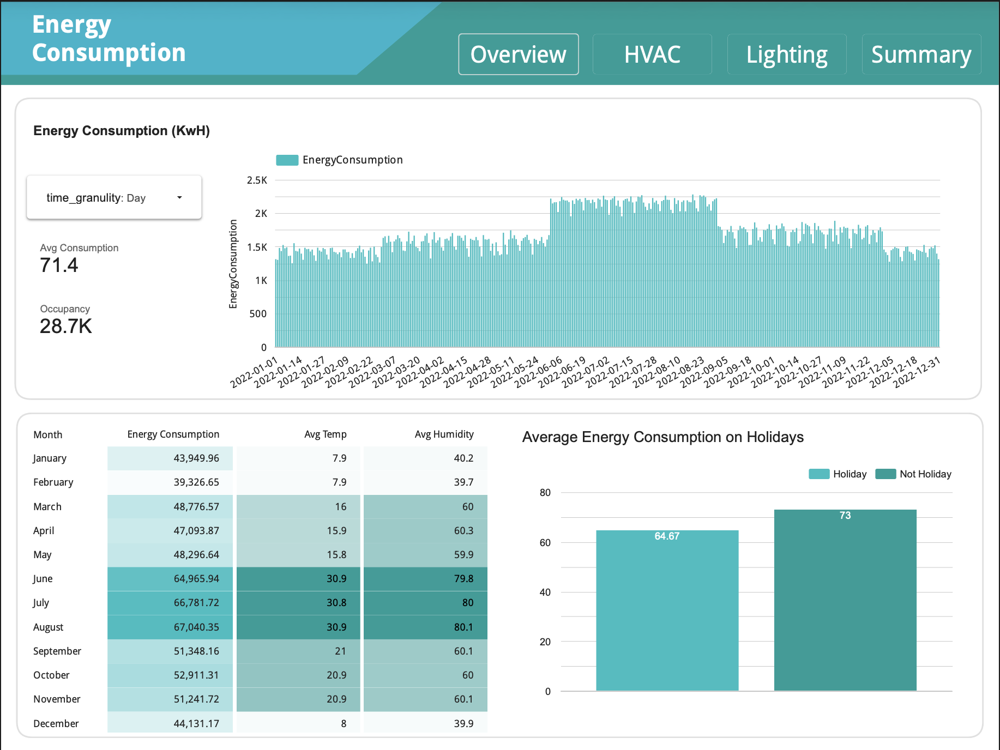
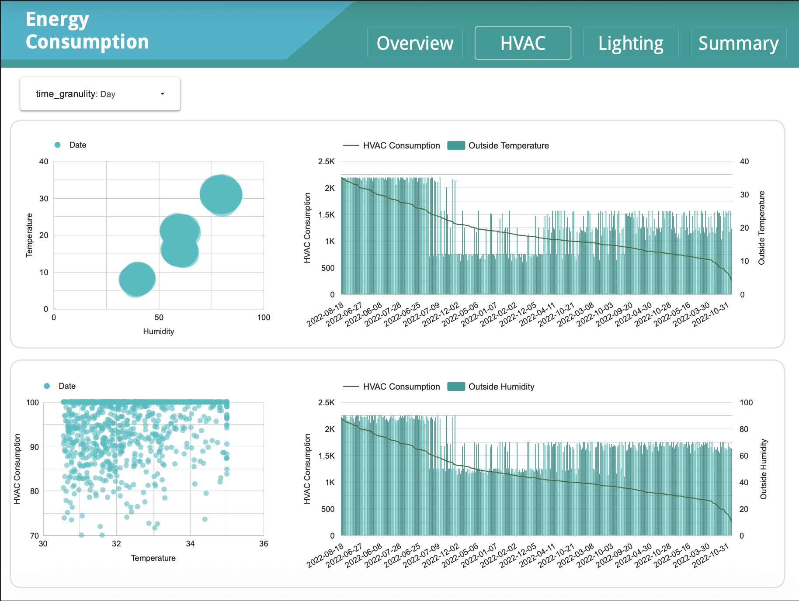
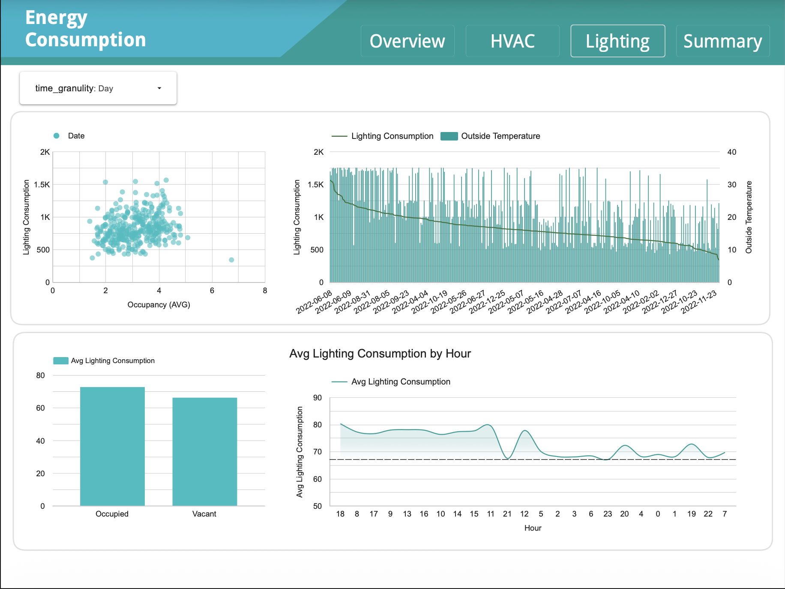
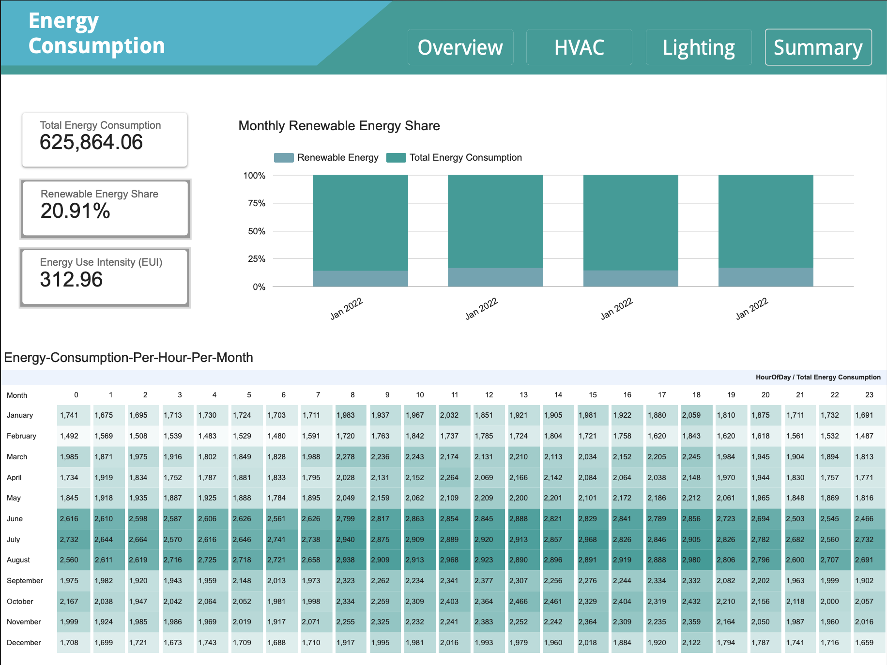

# ⚡ Energy Consumption Analysis Dashboard

This project demonstrates how to analyze and visualize building energy consumption patterns using **BigQuery** and **Looker Studio**.  
The dashboard showcases energy usage trends, environmental factor correlations, and occupancy pattern impacts to help optimize energy efficiency and reduce costs.

---

## 🚀 Project Overview

This dashboard provides comprehensive insights into building energy consumption by analyzing hourly data alongside key influencing factors such as temperature, humidity, occupancy, and HVAC/lighting usage patterns.

**Key Features:**
- Hourly energy consumption tracking with time series analysis
- Environmental factor correlation (temperature, humidity)
- Occupancy pattern analysis and its impact on energy usage
- HVAC and lighting usage optimization insights
- Renewable energy contribution tracking
- Multi-page dashboard with comprehensive energy metrics

---

## 🧱 Folder Structure

```
03-energy-consumption-analysis/
├── images/                    # Dashboard previews
│   ├── page_1.png
│   ├── page_2.png
│   ├── page_3.png
│   └── page_4.png
│
├── data/                      # Processed energy consumption data
│   └── energy_data_processed.csv
│
└── README.md                  # Project documentation
```

---

## 🧮 Data Pipeline Overview

1. **Data Collection**  
   Energy consumption data is collected hourly, capturing energy metrics, environmental conditions (temperature, humidity), building characteristics (square footage, occupancy), and system usage (HVAC, lighting).

2. **Feature Engineering**  
   Advanced features are created for time series analysis including lag features, rolling statistics, cyclical encoding for temporal patterns, interaction features, and derived metrics like energy per square foot and energy per occupant.

3. **Data Transformation**  
   Raw energy data is cleaned, transformed, and prepared for analysis using BigQuery's powerful SQL capabilities.

4. **BigQuery Storage**  
   Processed data is stored in BigQuery tables, enabling scalable analytics and efficient querying.

5. **Looker Studio Integration**  
   BigQuery data sources are connected to Looker Studio dashboards for interactive visualization and reporting.

6. **Dashboard Visualization**  
   Multiple dashboard pages provide comprehensive insights into energy consumption patterns, environmental correlations, occupancy impacts, and system optimization opportunities.

---

## 🖼️ Dashboard Preview

### Page 1


### Page 2


### Page 3


### Page 4


---

## 🧠 Technical Stack

- **BigQuery** – Data storage, transformation, and SQL modeling  
- **Looker Studio** – Dashboard creation and data visualization  
- **Python (optional)** – Data preprocessing and feature engineering  
- **SQL (BigQuery Standard SQL)** – Data preparation and aggregation  

---

## 📊 Data Files

The `data/` folder contains processed energy consumption data with engineered features including lag features, rolling statistics, cyclical encodings, interaction features, and derived metrics for comprehensive time series analysis.

---
